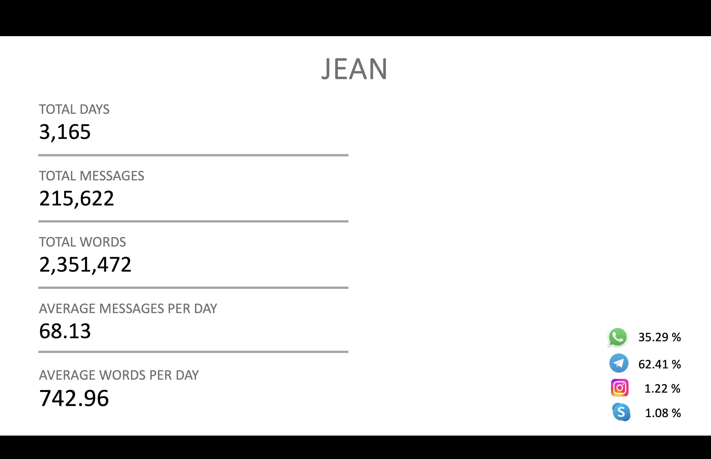
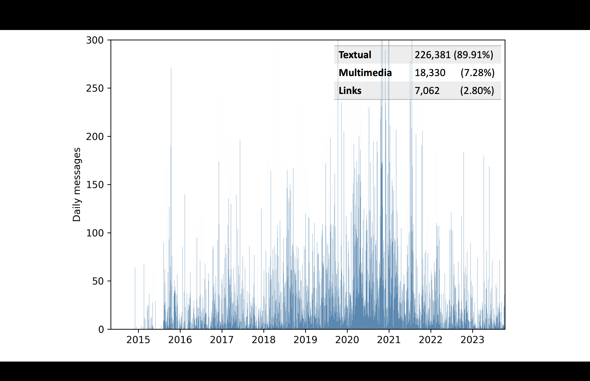
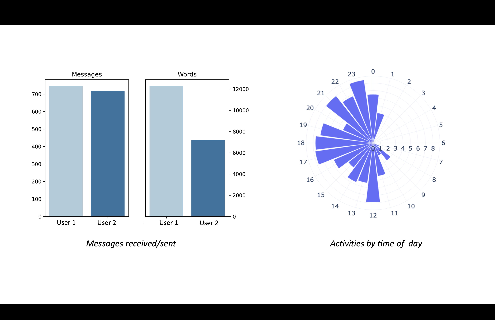
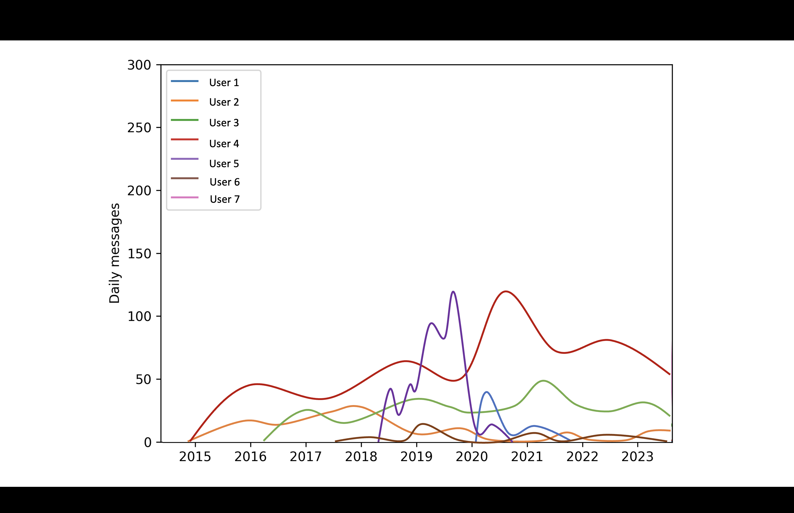

# CHAT ANALYZER

This work aims at analyzing locally stored personal chat exports, 
producing pdf reports for each user containing basic analytics such as: 
general stats, user's activity plots, most used emojis, 
most used words (word cloud) etc. 
It supports Whatsapp, Telegram, Instagram, Skype and two languages: English and Italian.

## Input

The script requires the export of the chats and some parameters as input, 
optionally a json file containing preferred usernames can be used to rename
nicknames and standardize names across all platforms. 
Users with different nicknames are otherwise considered separate entities. 
An example of the dictionary (old name : new name) is shown below:
```
{
  "Luke 🎸": "Luke",
  "Emily Hill": "Emily",
  "LOO-k": "Luke",
  "Emi 🦊": "Emily"
}
```

The supported formats for each platform are: <br />
WHATSAPP <br />
&nbsp; txt files, one for each chat <br />
TELEGRAM <br />
&nbsp; html files, one folder for each chat <br />
INSTAGRAM <br />
&nbsp; json files, one folder for each chat <br />
SKYPE <br />
&nbsp; messages.json export file <br />


## Usage

The required arguments are: <br />
&nbsp; your own username (-m, --myself), <br />
&nbsp; input folders for the desired platforms (--whatsapp --telegram --instagram --skype), <br />
&nbsp; output folder (-o, --output), <br />
&nbsp; the language (-l, --language)  <br />

optionally the user can specify the json dictionary to rename nicknames (-r, --rename), <br />
and a list of selected usernames to limit the analysis, 
which otherwise will consider every user appearing in the chats. 
<br />
Some examples of usage:

```
python chats.py -m Jean --whatsapp ../input/whatsapp --telegram ../input/telegram
```

```
python chats.py -m Jean -r ../input/rename.json --telegram ../input/telegram --instagram ../input/instagram Emily Mike Luke Matthew Emma Chloe 
```

## Examples






## License

[MIT](https://choosealicense.com/licenses/mit/)